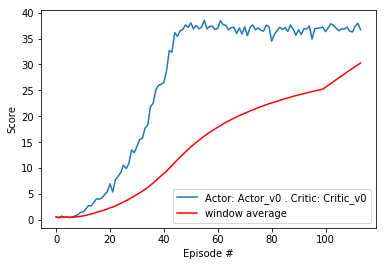

### Overview

The algorithm being used to train the agents are DDPG (Deep Deterministic Policy Gradient), which is one variant of Actor-Critic methods.

The main idea is to combine the best of both value-based methods where we try to derive a value function which outputs the estimated value for each state-action tuple of the agent, and policy-based methods where we try to output the policy directly without calculating value function. Key idea is to use the low variance of value-based estimates i.e Q-learning to neutralize the high variance characteristic of policy-based methods.

In particular, we maintain an Actor network which keeps updating the policy and generates samples to train the Critic, and a Critic network which calculates the Q-value of the current state-action to train the Actor.

We also make use of other techniques such as soft update (slowly updating model weights, 0.1% at a time) and replay buffer (keep track of a memory buffer to randomly sample from, to avoid learning the same experience again and again).

More theoretical background can be found in the [paper](https://arxiv.org/pdf/1509.02971.pdf) 

### Training

The actor and critic networks both have 256 units at layer 1 and 128 units at layer 2. I tried with denser networks but got little improvements, so I settled with this.

The agent (defined in `ddpg_agent.py`) use these hyperparameters as config

- BUFFER_SIZE = int(1e5)  # replay buffer size
- BATCH_SIZE = 128        # minibatch size
- GAMMA = 0.99            # discount factor
- TAU = 1e-3              # for soft update of target parameters
- LR_ACTOR = 5e-4         # learning rate of the actor 
- LR_CRITIC = 5e-4        # learning rate of the critic
- WEIGHT_DECAY = 0        # L2 weight decay

Initially the learning rate of actor and critics are both set at 1e-4 which makes the agents perform pretty poorly, the best average score it could reach is less than 5 after 200 episodes, which suggests that learning rate might be too slow. So I tried to increase it bit by bit, and got optimal result at 5e-4, where task is finished after 114 episodes. I also tried with higher learning rates but that makes performance dropped again.

Batch size is initially kept at 64 but setting it at 128 gives best result.

### Benchmark

Besides the scores, the moving average is also plotted as a red line. 

### Future work

- Try different network architecture for Actor and Critic i.e convolutional network.
- Introduce dropout / try different optimizers to reduce overfitting.
- Try out other Actor-Critic method variants such as PPO / A3C / GAE.